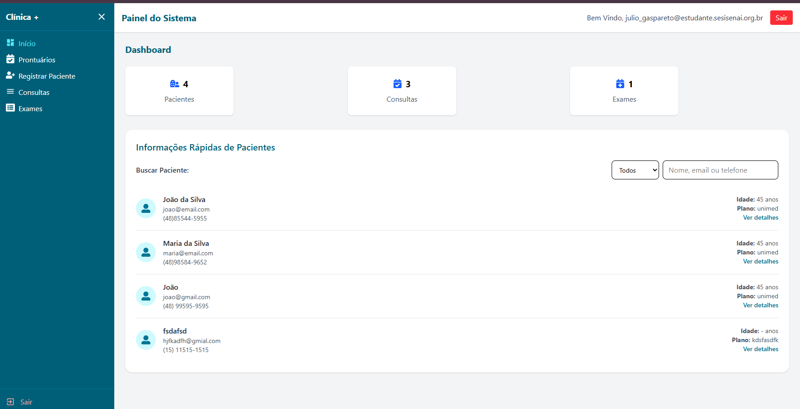
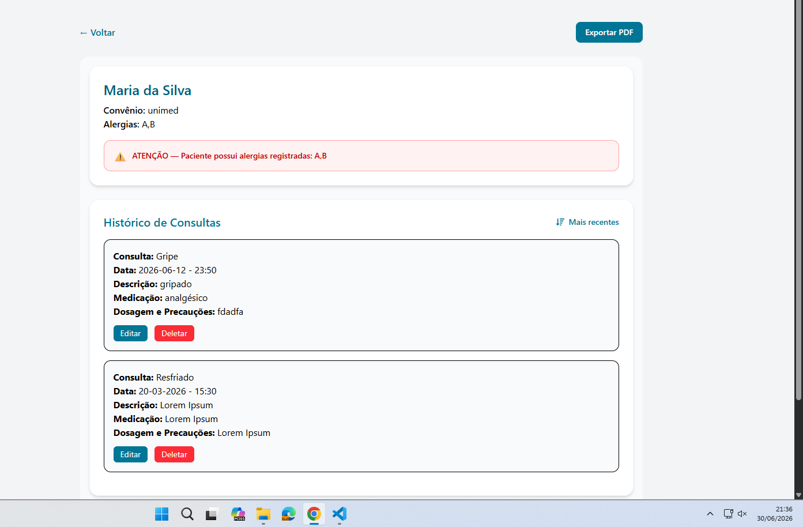

# Relatório de Atividade — Desenvolvimento de Features
**Projeto:** Clínica (Sistema de Gerenciamento de Pacientes)  
**Aluno:** Julio Cesar Valverde Gaspareto  
**Curso:** Técnico de Desenvolvimento de Sistemas — Terceira Fase  
**Data:** 30/06/2026  

---

## Ferramentas Utilizadas

| Ferramenta | Finalidade |
|---|---|
| React 19 + Vite 8 | Framework frontend |
| Tailwind CSS v4 | Estilização |
| Axios | Requisições HTTP |
| jsPDF | Geração de PDF |
| react-icons | Ícones (FaSortAmountDown, FaSortAmountUp) |
| json-server | Backend fake |
| Claude (IA) | Apoio no desenvolvimento |

---

## Feature 1 — Ordenação de Consultas e Exames por Data

### Descrição
Foi implementado um botão de ordenação no histórico de consultas e no histórico de exames
da tela de detalhes do paciente (`PatientDetails`). O usuário pode alternar entre
**"Mais recentes primeiro"** e **"Mais antigas primeiro"** de forma independente em cada lista.

### Problema identificado
Ao analisar o `db.json`, foi identificado que as datas estavam em dois formatos diferentes:
- `DD-MM-YYYY` — datas digitadas manualmente
- `YYYY-MM-DD` — datas vindas do `<input type="date">` do HTML

Isso causaria erros silenciosos na ordenação, pois o JavaScript não interpreta corretamente
datas no formato `DD-MM-YYYY`.

### Solução implementada

**Função `parseDateTime`** — detecta o formato e converte tudo para ISO antes de comparar:

```js
const parseDateTime = (dateStr, timeStr) => {
  if (!dateStr) return new Date(0)

  let isoDate = dateStr

  // Se vier no formato DD-MM-YYYY, converte pra YYYY-MM-DD
  if (/^\d{2}-\d{2}-\d{4}$/.test(dateStr)) {
    const [day, month, year] = dateStr.split('-')
    isoDate = `${year}-${month}-${day}`
  }

  return new Date(`${isoDate}T${timeStr || '00:00'}`)
}
```

**`useMemo`** — evita recalcular a ordenação em todo re-render:

```js
const sortedConsults = useMemo(() => {
  return [...consults].sort((a, b) => {
    const dateA = parseDateTime(a.date, a.time)
    const dateB = parseDateTime(b.date, b.time)
    return consultsSortOrder === 'desc' ? dateB - dateA : dateA - dateB
  })
}, [consults, consultsSortOrder])
```

> **Importante:** `[...consults].sort()` cria uma cópia do array antes de ordenar.
> Nunca se deve mutar o array que está no state diretamente — o React detecta mudanças
> por referência, e mutar o original impede re-renders corretos.

### Print da feature funcionando



> *Tela do dashboard mostrando a lista de pacientes com o select de busca avançada
> e o botão de ordenação disponível ao entrar nos detalhes do paciente.*

---

## Feature 2 — Busca Avançada de Pacientes

### Descrição
A tela de listagem de pacientes (`PatientsList`) já possuía busca por nome, email e telefone.
Foi adicionado um **select** ao lado do campo de busca, permitindo filtrar por:

- **Todos** — comportamento original (nome, email e telefone)
- **Convênio** — filtra pelo campo `healthInsurance`
- **Alergias** — filtra pelo campo `allergies`
- **Telefone** — filtra só pelo campo `phone`

### Principais pontos do código

**Novo estado para controlar o campo selecionado:**

```js
const [searchField, setSearchField] = useState('all')
```

**Lógica de filtro dinâmica:**

```js
const filteredPatients = patients.filter((patient) => {
  const term = searchTerm.toLowerCase()

  if (searchField === 'all') {
    return [patient.fullName, patient.email, patient.phone]
      .join(' ')
      .toLowerCase()
      .includes(term)
  }

  if (searchField === 'healthInsurance') {
    return (patient.healthInsurance || '').toLowerCase().includes(term)
  }

  if (searchField === 'allergies') {
    return (patient.allergies || '').toLowerCase().includes(term)
  }

  if (searchField === 'phone') {
    return (patient.phone || '').toLowerCase().includes(term)
  }

  return true
})
```

O placeholder do input também muda dinamicamente conforme o campo selecionado,
melhorando a experiência do usuário.

### Print da feature funcionando


> *Select com as opções Todos, Convênio, Alergias e Telefone visível ao lado do campo de busca.*

---

## Feature 3 — Exportar PDF do Prontuário

### Descrição
Foi adicionado um botão **"Exportar PDF"** na tela de detalhes do paciente.
Ao clicar, é gerado um arquivo PDF com os dados do paciente, consultas e exames,
salvo automaticamente com o nome do paciente.

### Problema encontrado durante desenvolvimento
A abordagem inicial foi usar `html2canvas` para capturar um screenshot da tela e
converter em PDF. Porém, o **Tailwind CSS v4** utiliza o formato de cor `oklch`
(mais moderno), que o `html2canvas` ainda não suporta. O erro gerado foi:

```
Error: Attempting to parse an unsupported color function "oklch"
```

### Solução adotada
Geração de PDF com texto puro via `jsPDF`, sem depender de captura de tela.
O resultado é um PDF mais limpo e sem problemas de compatibilidade.

**Criação do documento e paginação automática:**

```js
const pdf = new jsPDF('p', 'mm', 'a4')

// função que adiciona nova página quando o conteúdo ultrapassa o limite
const checkNewPage = () => {
  if (y > 270) {
    pdf.addPage()
    y = 20
  }
}

// salvamento com nome do paciente
pdf.save(`prontuario-${patient.fullName || 'paciente'}.pdf`)
```

### Print da feature funcionando



> *Botão "Exportar PDF" visível no canto superior direito da tela de detalhes do paciente.*

---

## Feature Nova — Alerta Visual de Alergias

### Descrição
Feature criada como contribuição original, não constando na lista sugerida pelo professor.

Um **alerta visual vermelho** é exibido automaticamente no card do paciente sempre que
ele possui alergias cadastradas. O alerta não aparece para pacientes sem alergias.

### Justificativa
Em sistemas de saúde, a visibilidade imediata de alergias é crítica para evitar erros médicos.
A feature garante que qualquer profissional que abra o prontuário seja alertado visualmente
antes de qualquer outra ação.

### Código implementado

```jsx
{patient.allergies && patient.allergies.trim() !== '' && (
  <div className="mt-4 flex items-center gap-2 bg-red-50
    border border-red-300 text-red-700 rounded-xl px-4 py-3">
    <span className="text-lg">⚠️</span>
    <p className="text-sm font-semibold">
      ATENÇÃO — Paciente possui alergias registradas: {patient.allergies}
    </p>
  </div>
)}
```

A condição `patient.allergies && patient.allergies.trim() !== ''` garante que o alerta
só aparece quando o campo não está vazio e não contém apenas espaços em branco.

### Print da feature funcionando


> *Faixa vermelha com ícone ⚠️ aparecendo automaticamente no card da Maria da Silva,
> que possui as alergias A,B cadastradas.*

---

## Conclusão

As quatro features foram implementadas com sucesso no projeto Clínica.
Durante o desenvolvimento foram identificados e resolvidos problemas reais:

- **Formatos de data inconsistentes** no banco de dados → resolvido com `parseDateTime`
- **Incompatibilidade do `html2canvas` com Tailwind v4** → resolvido trocando para `jsPDF` puro

### Resumo das features entregues

| # | Feature | Arquivo modificado |
|---|---|---|
| 1 | Ordenação de consultas e exames por data | `PatientDetails/index.jsx` |
| 2 | Busca avançada por convênio, alergias e telefone | `PatientsList/index.jsx` |
| 3 | Exportar prontuário em PDF | `PatientDetails/index.jsx` |
| Nova | Alerta visual automático de alergias | `PatientDetails/index.jsx` |
